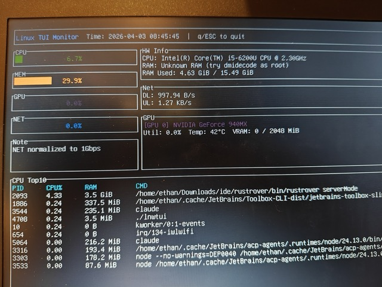

# lnwtui

## 功能

`lnwtui` 是一个运行在 Linux 上的 Rust 终端监控工具（TUI），用于实时查看系统资源占用情况。

- CPU 使用率监控
- 内存使用率与内存占用监控
- GPU 利用率、显存与温度监控（基于 `nvidia-smi`，适用于 NVIDIA GPU）
- 网络上下行速率监控
- 左侧统一利用率展示，右侧展示硬件与详细信息
- 下半部分显示 CPU 使用率 Top10 进程列表（PID、CPU%、RAM、命令行）
- 启动时会先清空当前终端内容（类似 `clear`）
- 退出时（`q` 或 `Esc`）会再次清空终端内容
- 按 `q` 或 `Esc` 退出

## 安装

### 环境要求

- Linux
- Rust（建议使用稳定版，包含 `cargo`）

### 获取与构建

```bash
git clone <你的仓库地址>
cd lnwtui
cargo build
```

### 可选依赖

- `nvidia-smi`：用于读取 NVIDIA GPU 信息
- `dmidecode`（通常需要 root 权限）：用于读取更详细的内存型号信息

## 运行

在项目目录执行：

```bash
cargo run
```

运行后将进入 TUI 界面，实时刷新系统监控数据。

## 截图


